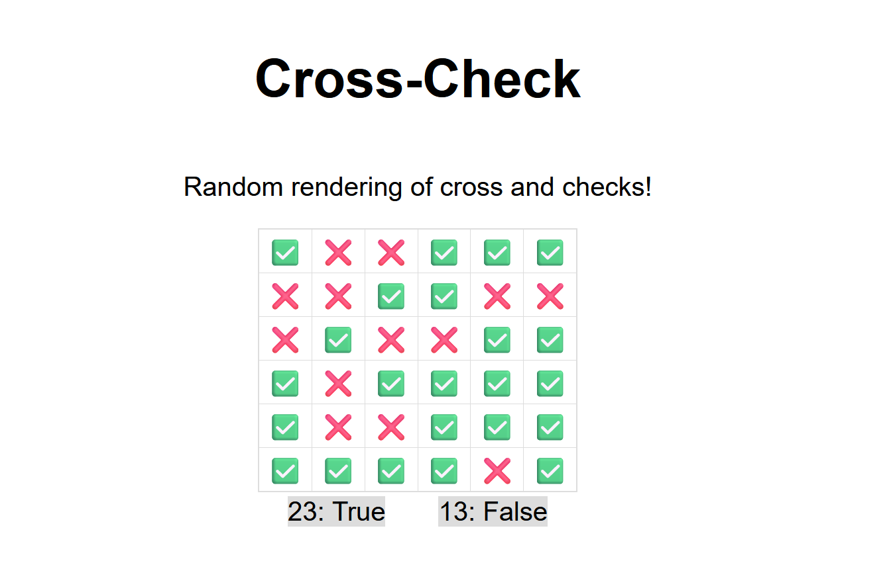

## How to run the application ?

1. Clone this repository
2. Install the dependencies using pip (assuming you have python installed)

```bash
pip install -r requirements.txt
```

3. Run the application

```bash
python app.py
```

4. Open your browser and go to http://localhost:5000

<br>
<br>

# TADA!!!! Setup is complete!

Now the application should look like this:
<br>

